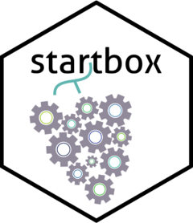

<!-- README.md is generated from README.Rmd. Please edit that file -->

# startbox 

<!-- badges: start -->
<!-- badges: end -->

The goal of startbox is to manage and visualize experimental data in
plant protection trials.

This R package was developped as part of the STAR project 2024-2027
(France), with the support of the French Ministry of Agriculture and
Food, and the financial contribution of the special allocation account
for agricultural and rural development (CASDAR). The responsability of
the French Ministry of Agriculture and Food cannot be engaged.

## Installation

You can install the development version of startbox from
[GitHub](https://github.com/) with:

``` r
#install.packages("devtools")  # if not already installed
devtools::install_github("vignevin/startbox")
```

If you also want to install the vignette (which serves as a tutorial for
the package), run this after installation:

``` r
devtools::install(build_vignettes = TRUE)
```

Once installed, you can access the vignette with:

``` r
vignette("startbox")
#> Warning: vignette 'startbox' introuvable
```

## Contribution

You can contribute to this projetc project by creating a pull request,
or use issues to track bugs or suggest ideas in a repository.
